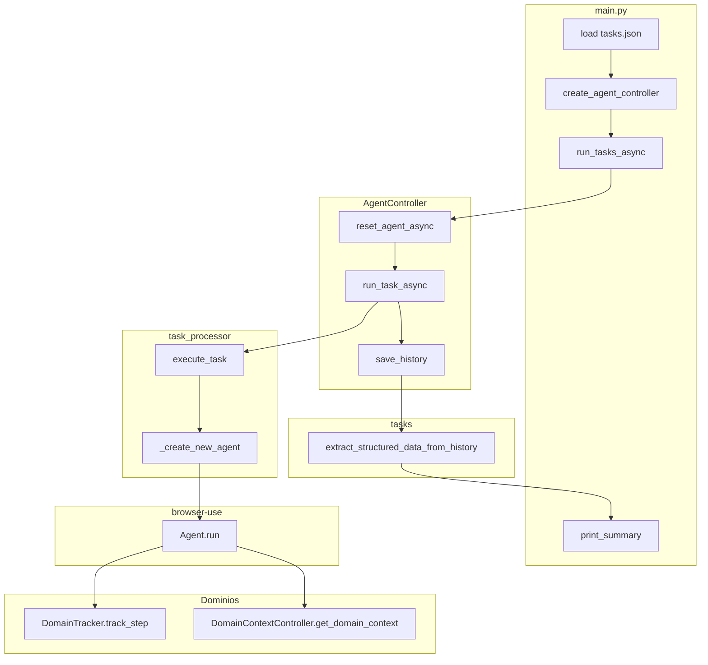

# Arquitectura del agente recursivo de contexto

## Visión general

El sistema ejecuta tareas de navegación web autónoma mediante browser-use y un LLM (Claude Haiku 4.5 vía AWS Bedrock). El flujo principal es:

```
main.py → create_agent_controller → run_tasks_async → run_task_async → execute_task → Agent.run()
```

Cada tarea se procesa secuencialmente; el historial se guarda y se extraen entidades estructuradas al final.

## Diagrama de flujo de ejecución



## Módulos y responsabilidades

| Módulo | Responsabilidad |
|--------|-----------------|
| `agente/agent.py` | **AgentController**: orquestación del ciclo de vida (reset, ejecución, cancelación), gestión de browser/LLM, callbacks de paso |
| `agente/domain_context.py` | **Contexto recursivo por dominio**: persistencia en `domains_context.json`, herramienta `get_domain_context`, actualización con LLM |
| `agente/domain_tracker.py` | **DomainTracker**: tracking de dominios visitados, historial de visitas, triggers de actualización (salida de dominio, refresco cada N pasos) |
| `agente/task_processor.py` | **execute_task**: creación de Agent con configuración, llamada a `agent.run()`, callbacks de paso y cancelación |
| `agente/browser_manager.py` | Inicialización, cierre y gestión del Browser (Playwright/Chromium) |
| `agente/llm_manager.py` | Creación de instancias LLM (ChatAnthropicBedrock) |
| `agente/config.py` | Configuración centralizada: variables de entorno, rutas, timeouts, parámetros del agente |
| `agente/history_manager.py` | Guardado de historial en `logs/` |
| `agente/error_handler.py` | Clasificación y manejo de errores (CDP, browser) |
| `tasks/data_extractor.py` | **extract_structured_data_from_history**: parseo del historial y extracción de entidades según esquemas en `schemas.py` |
| `schemas.py` | Esquemas Pydantic para extracción estructurada (MediaTrendSchema, SearchTrendSchema, etc.) |

## Flujo de datos

1. **Entrada**: `tasks/tasks.json` → lista de tareas con `name` y `description`
2. **Ejecución**: Cada tarea pasa por `run_task_async` → `execute_task` → `Agent.run(max_steps=...)`
3. **Durante la ejecución**: En cada paso, `DomainTracker.track_step` acumula historial por dominio y, al salir o cada N pasos, actualiza el contexto con el LLM
4. **Salida**: Historial guardado en `logs/history.json` y `logs/final_history.json`
5. **Extracción**: `extract_structured_data_from_history` parsea `action_results`, aplica esquemas y devuelve lista de entidades (market intelligence)

## Configuración

Toda la configuración se centraliza en `agente/config.py`. Las variables de entorno se cargan desde `.env` si existe (pydantic-settings). Principales bloques:

- **AWS/Bedrock**: `AWS_REGION`, `BEDROCK_MODEL_ID`
- **Navegador**: `BROWSER_LAUNCH_TIMEOUT_S`, `CROSS_ORIGIN_IFRAMES`, `MAX_IFRAMES`
- **Agente**: `MAX_STEPS`, `STEP_TIMEOUT`, `MAX_HISTORY_ITEMS`, `MAX_FAILURES`
- **Contexto por dominio**: `DOMAIN_CONTEXT_REFRESH_STEPS`, `DOMAIN_CONTEXT_MIN_STEPS_FOR_UPDATE`, `DOMAIN_CONTEXT_MAX_LENGTH`

## Restricciones arquitectónicas

1. **Mono-hilo y mono-proceso**: Solo asyncio; no threading ni multiprocessing en código propio.
2. **Integridad del flujo agente-LLM**: No se filtran ni alteran entradas/salidas del modelo; solo prompts y mecanismos nativos.
3. **Contexto por dominio**: El agente obtiene contexto acumulado exclusivamente mediante la herramienta `get_domain_context`, invocada por decisión del LLM, no por inyección desde código.
4. **Detección de bucles**: Delegada a browser-use (`loop_detection_enabled=True`).
